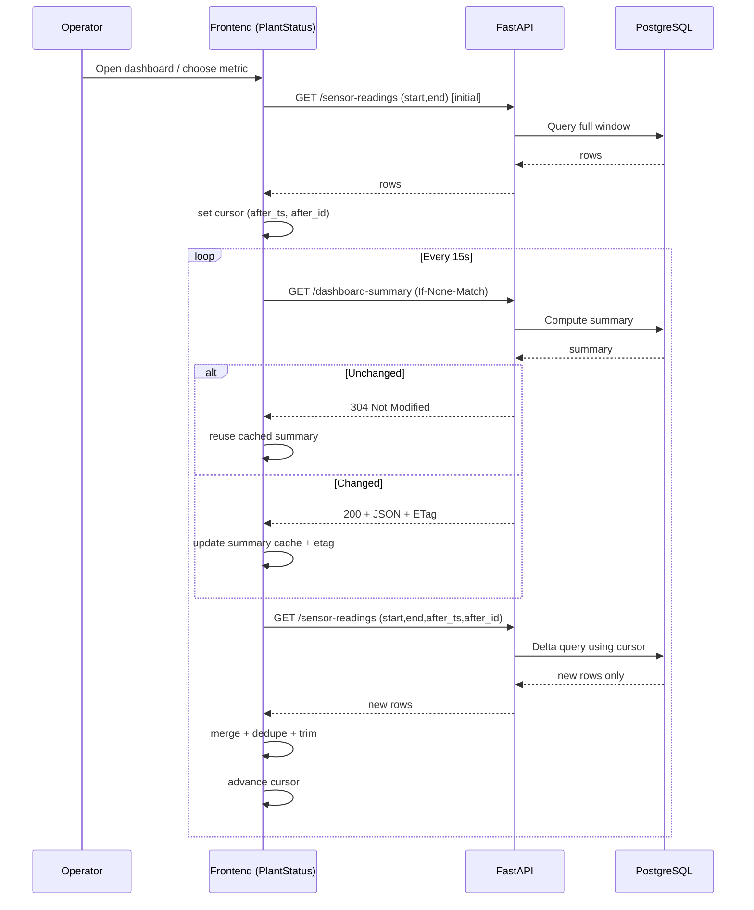

# IndustrialDashboard

## Live Demo

- Frontend: `https://industrialdashboard-frontend.onrender.com`
- API base: `https://industrialdashboard-api.onrender.com`
- API docs: `https://industrialdashboard-api.onrender.com/docs`

## What This App Does

Industrial facility monitoring dashboard with:

- facility and asset modeling (`facilities`, `assets`, `metrics`, `sensor_readings`)
- timestamped sensor readings queryable by facility, asset, metric, and time range
- current plant status cards (latest-per-asset summary by metric)
- per-card aggregation selector (`Total`, `Average`, `Minimum`, `Maximum`)
- D3 time-series chart with:
  - aggregated trend line
  - per-asset marker dots (color-coded)
  - tooltip showing aggregate value + original per-asset values at that timestamp
- auto-refresh polling, custom datetime range picker, and dark mode

## Tech Stack

- Backend: FastAPI + psycopg (PostgreSQL)
- Frontend: React + Vite + Ant Design + D3
- Deployment: Render (Blueprint via `render.yaml`)

## Local Development

### 1. Prerequisites

- Python 3.11+
- Node.js 18+
- PostgreSQL running locally (`localhost:5432`)

If `psql` shows `Connection refused`, start Postgres first.

### 2. Install dependencies

From repo root:

```bash
python3 -m venv .venv
source .venv/bin/activate
pip install -r requirements.txt
```

Frontend dependencies:

```bash
cd frontend
npm install
cd ..
```

### 3. Initialize database schema and sample data

Use your local DB user and DB name (example uses `postgres` DB):

```bash
psql -h localhost -U <db_user> -d postgres -f backend/init.sql
psql -h localhost -U <db_user> -d postgres -f backend/seed_sample_data.sql
```

Optional seed tuning in a single `psql` session:

```sql
SET app.sample_hours_back = '72';
SET app.sample_step_minutes = '10';
\i backend/seed_sample_data.sql
```

Notes:

- `seed_sample_data.sql` truncates and recreates seeded data each run.
- Synthetic timestamps stop at `now() - 1 minute` to avoid future-time check violations.

### 4. Run backend API (Terminal A)

```bash
source .venv/bin/activate
export DATABASE_URL="postgresql://<db_user>@localhost:5432/postgres"
export CORS_ALLOW_ORIGINS="http://localhost:5173,http://127.0.0.1:5173"
uvicorn backend.main:app --reload
```

API endpoints locally:

- Swagger: `http://127.0.0.1:8000/docs`
- ReDoc: `http://127.0.0.1:8000/redoc`

### 5. Run frontend (Terminal B)

```bash
cd frontend
echo 'VITE_API_BASE_URL=http://127.0.0.1:8000' > .env.local
npm run dev
```

Open: `http://localhost:5173`

## Local Testing Checklist

### API smoke tests

```bash
curl "http://127.0.0.1:8000/facilities"
curl "http://127.0.0.1:8000/facilities/1"
curl "http://127.0.0.1:8000/sensor-readings?facility_id=1&asset_id=2&metric_name=power_kw&start=2026-02-23T00:00:00Z&end=2026-02-23T12:00:00Z&limit=200"
curl "http://127.0.0.1:8000/facilities/1/dashboard-summary"
```

For `/facilities/{id}/dashboard-summary`, each metric now includes:

- `aggregation` (default display aggregation)
- `aggregated_value` (value for that default)
- `aggregation_values` object with `sum`, `avg`, `min`, `max`

### Frontend behavior checks

- Select a metric card: trend chart switches to that metric.
- Change card aggregation dropdown: card value updates and trend aggregation updates.
- Hover chart: tooltip shows aggregate value and per-asset original values.
- Verify asset marker legend colors match chart marker colors.
- Change facility/asset/time range and confirm data refreshes.

### Build/lint checks

```bash
python3 -m compileall backend
cd frontend && npm run lint && npm run build
```

## API Endpoints

### `GET /facilities`
Returns all facilities.

### `GET /facilities/{facility_id}`
Returns facility details including its assets.

### `GET /sensor-readings`
Returns sensor readings with optional filters.

Query params:

- `facility_id` (int)
- `asset_id` (int)
- `metric_name` (string)
- `start` (ISO datetime)
- `end` (ISO datetime)
- `after_ts` (ISO datetime, optional cursor; use with `after_id`)
- `after_id` (int, optional cursor; use with `after_ts`)
- `limit` (int, default `500`, max `5000`)

### `GET /facilities/{facility_id}/dashboard-summary`
Returns plant status from latest reading per `(asset_id, metric_id)`, aggregated by metric.

Conditional request support:

- Send `If-None-Match` with the last `ETag` value.
- Response is `304 Not Modified` (empty body) when summary data has not changed.

Response per metric includes:

- `metric_name`
- `unit`
- `aggregation`
- `aggregated_value`
- `aggregation_values` (`sum`, `avg`, `min`, `max`)
- `latest_ts`
- `contributing_assets`

## Data Flow Diagrams

```mermaid
flowchart LR
  UI[Frontend: PlantStatus.tsx] -->|Initial| F1[/GET /facilities/]
  UI -->|Facility change| F2[/GET /facilities/{id}/]
  UI -->|Every 15s| S1[/GET /facilities/{id}/dashboard-summary<br/>If-None-Match: etag?/]
  UI -->|Every 15s| S2[/GET /sensor-readings<br/>start,end,after_ts?,after_id?/]

  S1 --> R[FastAPI routes.py]
  S2 --> R
  R --> SV[services.py]
  SV --> DB[(PostgreSQL)]

  S1 --> E1{ETag matches?}
  E1 -->|Yes| E304[304 Not Modified]
  E1 -->|No| E200[200 JSON + ETag]

  S2 --> C1{Cursor provided?}
  C1 -->|No| Q1[Full window read<br/>ORDER BY ts DESC,id DESC LIMIT]
  C1 -->|Yes| Q2[Delta read<br/>WHERE ts > after_ts OR<br/>(ts=after_ts AND id>after_id)<br/>ORDER BY ts ASC,id ASC LIMIT]

  E304 --> UI
  E200 --> UI
  Q1 --> UI
  Q2 --> UI

  UI --> M1[Trend merge + dedupe by id + trim to window]
  UI --> M2[Update cursor after_ts/after_id]
```



## Project Structure

```text
backend/
  main.py              # FastAPI app entrypoint
  api/
    db.py              # DB connection/config
    schemas.py         # Pydantic response models
    services.py        # Query/business logic
    routes.py          # HTTP routes
frontend/
  src/
    components/
      PlantStatus.tsx
      TimeSeriesChart.tsx
```
